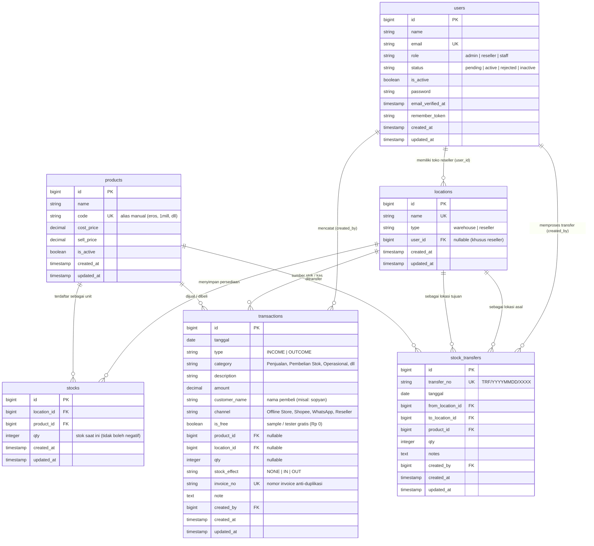

]# Entity-Relationship Diagram (ERD) — Scentpeep Management System

Diagram relasi entitas diturunkan langsung dari skema database aktual hasil refaktor:

```mermaid
erDiagram
    users ||--o{ locations : "memiliki toko reseller (user_id)"
    users ||--o{ transactions : "mencatat (created_by)"
    users ||--o{ stock_transfers : "memproses transfer (created_by)"

    locations ||--o{ stocks : "menyimpan persediaan"
    locations ||--o{ transactions : "sumber stok / kas"
    locations ||--o{ stock_transfers : "sebagai lokasi asal"
    locations ||--o{ stock_transfers : "sebagai lokasi tujuan"

    products ||--o{ stocks : "terdaftar sebagai unit"
    products ||--o{ transactions : "dijual / dibeli"
    products ||--o{ stock_transfers : "ditransfer"

    users {
        bigint id PK
        string name
        string email UK
        string role "admin | reseller | staff"
        string status "pending | active | rejected | inactive"
        boolean is_active
        string password
        timestamp email_verified_at
        string remember_token
        timestamp created_at
        timestamp updated_at
    }

    locations {
        bigint id PK
        string name UK
        string type "warehouse | reseller"
        bigint user_id FK "nullable (khusus reseller)"
        timestamp created_at
        timestamp updated_at
    }

    products {
        bigint id PK
        string name
        string code UK "alias manual (eros, 1mill, dll)"
        decimal cost_price
        decimal sell_price
        boolean is_active
        timestamp created_at
        timestamp updated_at
    }

    stocks {
        bigint id PK
        bigint location_id FK
        bigint product_id FK
        integer qty "stok saat ini (tidak boleh negatif)"
        timestamp created_at
        timestamp updated_at
    }

    stock_transfers {
        bigint id PK
        string transfer_no UK "TRF/YYYYMMDD/XXXX"
        date tanggal
        bigint from_location_id FK
        bigint to_location_id FK
        bigint product_id FK
        integer qty
        text notes
        bigint created_by FK
        timestamp created_at
        timestamp updated_at
    }

    transactions {
        bigint id PK
        date tanggal
        string type "INCOME | OUTCOME"
        string category "Penjualan, Pembelian Stok, Operasional, dll"
        string description
        decimal amount
        string customer_name "nama pembeli (misal: sopyan)"
        string channel "Offline Store, Shopee, WhatsApp, Reseller"
        boolean is_free "sample / tester gratis (Rp 0)"
        bigint product_id FK "nullable"
        bigint location_id FK "nullable"
        integer qty "nullable"
        string stock_effect "NONE | IN | OUT"
        string invoice_no UK "nomor invoice anti-duplikasi"
        text note
        bigint created_by FK
        timestamp created_at
        timestamp updated_at
    }
```
